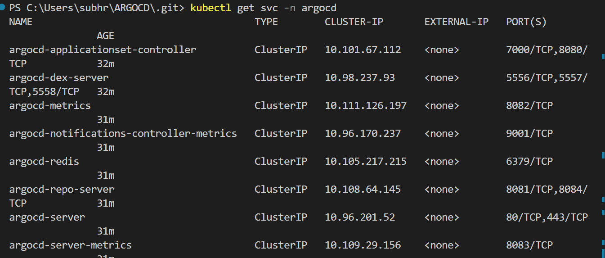
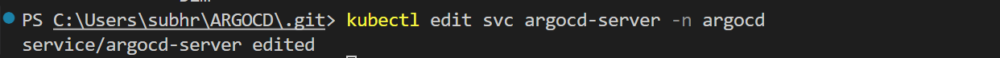
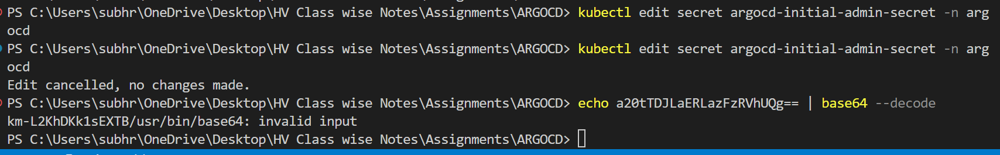

# ARGOCD
This is an K8's management with Argo cd IT OPS as teh single source of Truth 
Step 1: Create  Git Repo on GIT HUB nd then create a folder on Local computer and clone the Git 
Step 2 : Start teh Minikube and once started run Minikube status 
Step 3 : Navigate to the Argo cd documnts page "https://argo-cd.readthedocs.io/en/stable/getting_started/" and  then click on getting started from the left pane 
Step 4: chose or copy teh command 
> kubectl create namespace argocd 
> kubectl apply -n argocd -f https://raw.githubusercontent.com/argoproj/argo-cd/stable/manifests/install.yaml
Step 5: 
Step 10: Run the command 
Kubectl get pods -n argocd -w       //argocd is teh name above i used to cfreate my namespace make sure all pods are running as expected 

Step 11: Run teh below command to verify teh ragocd services are in running status
kubectl get svc -n argocd

Note: argocd-server this service is responsible to interact with  Argocd using the UI of the CLi of argocd
Step 12: run command to expose teh service 
kubectl edit svc argocd-server -n argocd
The above command will open a file of kubectl chnage the tyoe clusterIP by default to NodePort os that we can access this service from my terminal or browser using some port forwarding for browser access  . Remember to edit and save teh file and once saved you should receiev teh meessage on your terminal as below "service/argocd-server edited"

Step 13: perform Port-forwarding so that teh same edited service can be access from the browser Run the command 
minikube service argocd-server -n argocd 
Step-14 The above command will display the IP for the HTTP and HTTPs acecss for tunnel for service argocd-server, 

Step 15: Choose either of them( http or https) and paste it on browser and proceed ignoring the warning and click on advanced and BOOM you have the UI for Argo CD . You can run DEX commandds whcih is teh one that helps incorporate SSO from gmail or facebook etc which is bit advanced 

Step 16- DO NOt close the service running tab else teh GUI will be suspended and start new Terminal for rest task

Step 17: HOW TO GET THE ARGOCD UI PASSWORD
kubectl get secret -n argocd

Step 18: EDIT PASSOWRD
kubectl edit secret argocd-initial-admin-secret -n argocd

Step 19:DECODE PASSWORD
 Teh above command will give the password in the Hexadecimal and need to be decoded thus run teh below command
 echo <secret from the above command > | base64 --decode                    
 
 use teh password generated  with username as admin which is by default and we havent chnaged anywhere yet 

 Step 20 : Deploy an app guesbook with Kubernetes from teh Github url "https://github.com/argoproj/argocd-example-apps"

 The same folder has been forked and is present in my  repo too 

 Step 21: DEPLOY APPLICATION IN ARGOCD USING basic deplyment.yml and service .yml file from teh above mentioned github url for app guestbook
 - create application 
 - fill teh details as below and click create
 application name - all should be in lower case 
 Project name - lower cae and should be default 
 cluster name - should be selected default that comes up in my case its https://kubernetes.default.svc
 sync plicy is Automatic 
 name- as per your choice but in all lower case 

Step 22 : Create an app using HELM CHART
Fill the details as above 
in Path choose helm-guestbook for the helm value,yml and chart yml which will be used by argo to create further 

STEp 23: ARGO USING CLI 
- Go to the page https://github.com/argoproj/argo-cd/releases/tag/v2.10.8
- Scroll down to choos eteh windows compatible downloadable 
- Once downloaded run teh .exe file from cmd
- save teh oath in the environmental variables of system path
- run argocd version to cofnrim if its installed as teh output should be as below 
argocd: v2.10.8+37b1cf5
  BuildDate: 2024-04-26T13:48:08Z
  GitCommit: 37b1cf5306f9c245f188c4c0566c23a0f80cdc65
  GitTreeState: clean
  GoVersion: go1.21.9
  Compiler: gc
  Platform: windows/amd64
time="2024-04-29T02:11:44+05:30" level=fatal msg="Argo CD server address unspecified"

Step 24: On How to use the ARGICD CLI to create an app similar to above we created using teh GUI

- Browse to the page for all basic to expert level daya to day Argocd commands  URL https://argo-cd.readthedocs.io/en/stable/user-guide/commands/argocd/ 

-click on teh Argocd app
- click on teh Argocd app create 
- copy the first one from teh example " Create a directory app"

  # Create a directory app
  argocd app create guestbook --repo https://github.com/argoproj/argocd-example-apps.git --path guestbook --dest-namespace default --dest-server https://kubernetes.default.svc --directory-recurse

  Step 25: #Perform the LOGIN to ARGOCD from the CLI
  argocd login 127.0.0.1:58012
  Note : if the above command return that argocd is not recognisable then provide teh full path and login iwth server name as below 

  Provide teh username as admin and teh password teh same that you converted to hexadecimal and teh ip and URL is teh same as provided by Argocd when we ran teh command  
  minikube service argocd-server -n argocd
  

  Step 26: Perform a manual sync form the GUI version as teh auto sysnc was not enabled 

Your app is created using cli 

********HUB AND SPOKE ARGOCD CONFIGURATION ********************************

Step 1: eksctl create cluster --name cluster-Hub --region ap-south-1
        eksctl create cluster --name cluster-spoke2 --region ap-south-1
        eksctl create cluster --name cluster-spoke1 --region ap-south-1

Step 2: kubectl config get-contexts | grep ap-south-1

Step 3: By default the cluster will be selected which is created at the end but if you want to swicth to some           particular  cluster run the below command 

        kubectl config use-context iam-root-account@cluster-Hub.ap-south-1.eksctl.io

Step 4:  chose or copy teh command 
> kubectl create namespace argocd 
> kubectl apply -n argocd -f https://raw.githubusercontent.com/argoproj/argo-cd/stable/manifests/install.yaml

Steps 5 : Check and verify if teh pods are running
kubectl get pods -n argocd

Step 6:Fetch the config map so you can edit the same , Run teh below command to fetch the confirg map
kubectl get cm -n argocd

Step 7: find the file in argo https://github.com/argoproj to add to teh config map file so we can browse insecure manner using http
next go to the github path docs/operator-manual/argocd-cmd-params-cm.yaml

Step 7:
Add data in particular to teh configmap fetched from above 
kubectl edit configmap argocd-cmd-params-cm -n argocd
add at the end of the file below lines 
data:
 server.insecure: "true"

Post succesful editing and saving you shoukd have the below message 

**********************************************************************************************************************
NOW TEH MILLION DOLLAR QUESTION HOW TEH CHANGE ABOVE IN THE CONFIGMAP IS GOING MAKE ARGOCD SERVER COMMUNICATE OVER HTTP ?
Run the below to get teh configmap file linked in teh argocd-server
kubectl describe deployment/argocd-server -n argocd
Thsi configmap is actually mounted and envornment variables are all referenced for this configmap

Step 8:Now chnage teh Port type to Nodeport 
use the command below to go to teh argocd server
kubectl edit svc argocd-server -n argocd

To verify if the chnages were iplemented and saved , Execute below command 
kubectl get svc -n argocd

Step 9: As you see form the below the HTTP is running on port 31134 and we are concerned about it , 
argocd-server                             NodePort    10.100.91.134    <none>        80:31134/TCP,443:31393/TCP

- Go to the AWS console 
- Copy the Public IP of teh HUB node Ec2 instance and browse with the ':' http port as mentioned of your argocd in my case its 31134
- Make sure to allow the Inbound any to the internet in security group of the HUB cluster Node Ec2 instance 
- If all is succesful you will see the argocd GUI login screen 

Step 10 :To Login to the Argocd console
kubectl get secret -n argocd

Step 18: EDIT PASSOWRD
kubectl edit secret argocd-initial-admin-secret -n argocd

&**************************************************************************************************************
ADD THE CLUSTERS SPOKE TO TEH HUB 

Step1 :Argocd CLI Lofgin
- execute teh below to fetch all teh contexts for teh clusetr spoke to be added to HUB 
kubectl config get-contexts | grep ap-south-1

Step 2 :
Run teh below command with teh spoke context followed by the hubpublic Ipand teh HTTP port 
argocd cluster add  iam-root-account@cluster-spoke2.ap-south-1.eksctl.io --server 3.111.52.223:31134

Step 3: its deployed as per teh message lets check on protal 
go to teh app 
before 

After cluster 2 is added 

create application 

So now you can add a namespace and other detailsa nd create thus now all clusters are connected to hub 

